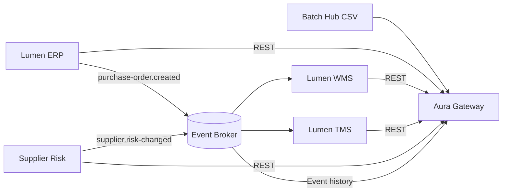

# Architecture

Each application exposes `/health` and `/metadata`. Metadata describes the business object, key, fields, endpoint, freshness and emitted/consumed events. Aura can therefore discover a source before requesting samples.

## Design principles

- Synthetic but coherent cross-system identifiers.
- Explicit timestamps and freshness.
- Deterministic alerts separate from the LLM.
- API, event and file patterns in one small demonstrator.
- No credentials or personal data.
